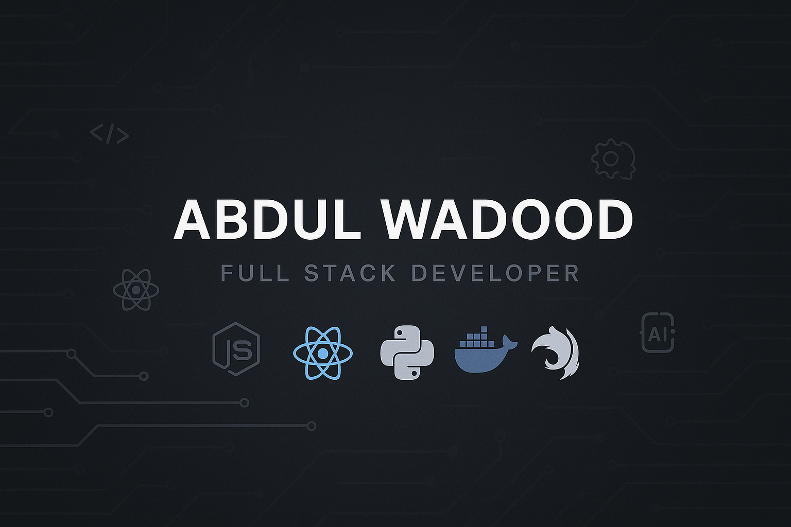

# Hey Everyone! I'm Abdul Wadood 👋  

  
  
  

---

## 🚀 Full Stack Developer | AI Engineer in Progress | SaaS Builder  

- 🧑‍💻 **Full Stack Engineer** (MERN, MEAN, NestJS, Docker, AWS)  
- 🧠 **AI/ML Explorer** - Python, Jupyter, OpenAI, LangChain  
- 🔗 Building SaaS Products | Real-Time Systems | Scalable Architectures  
- 🌍 Based in Pakistan 🇵🇰  
- 📬 DM me on [LinkedIn](https://www.linkedin.com/in/ranaabdulwadood) or [Twitter](https://twitter.com/abdulwadood918)  

---

## 🔧 Tech Stack  
     
     
    

---

## 💡 Currently Working On  

- 📚 Building a daily Python + AI learning schedule  
- 💬 Real-time Chat Application with Admin/Customer Interface  
- 🎯 Planning a side SaaS product focused on Workation for a German Firm  

---

## 🖼️ Featured Projects  

### 📡 Real-Time Chat Application  
A chat platform with admin and customer interfaces, featuring real-time communication, user management, and analytics.  
- **Tech Stack**: React, NestJS, Socket.io, MongoDB, AWS  
- [🔗 View Repository](#) | [🌐 Live Demo](#)  

### 🌍 SaaS Product for Workation  
A SaaS platform tailored for remote work and vacation planning, optimized for scalability and user experience.  
- **Tech Stack**: TypeScript, Node.js, PostgreSQL, Redis  
- [🔗 View Repository](#) | [🌐 Live Demo](#)  

## 📈 Contributions (Last Year)

### Quick Stats

| Stats            | Count                       |
|------------------|-----------------------------|
| ⭐ Stars         |  |
| 🔀 PRs Merged    |  |
| 🛠️ Issues Closed |  |
| 🖊️ Commits       |  |
| 👥 Followers     |  |

## 🎯 Fun Facts  

- 🔥 I prefer building over consuming.  
- 🔍 Passionate about learning how AI agents work.  
- 📖 I enjoy audio books and long tech podcasts.  
- 🏕️ I love family time, outdoor exploration & mini tech experiments.  

---

## 🧠 Ask Me About  

> `React` • `NestJS` • `Socket.io` • `AWS Deployment` • `AI App Ideas` • `SaaS Planning` • `Python Basics` • `Angular` • `Express` • `Node`  

---

## 📫 Reach Me  

- 💼 [LinkedIn](https://www.linkedin.com/in/rana-abdul-wadood)  
- 🐦 [Twitter](https://twitter.com/abdulwadood918)  
- 📧 Email: devwadood@gmail.com  

---

## 📜 License  
This repository is licensed under the MIT License.  

---

Let me know if you'd like any additional changes or customizations!
